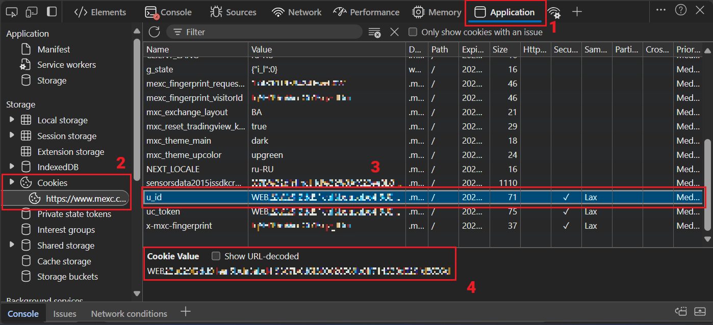

# 🔑 Where to get MEXC token?

1. Log in to your MEXC account via web browser.
2. Open the browser's Developer Tools:
   - Press **F12**  
   - Or right-click anywhere on the page and select **Inspect**.
3. Navigate to the **Application** (Chrome/Edge) or **Storage** (Firefox) tab.
4. In the sidebar, expand the **Cookies** section.
5. Select the cookie storage for the MEXC domain (e.g., `mexc.com`).
6. Find the cookie named `u_id`.
7. Copy the value of `u_id` — this is your API key (it usually starts with `WEB`).

   

> [!NOTE]
> The API key is **valid for 5 days** from the moment of login.

> [!IMPORTANT]
> If you click **Logout** in the MEXC web interface, the key immediately **expires** and can no longer be used.
